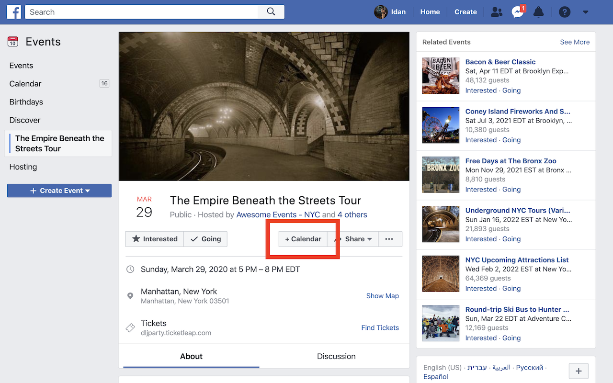
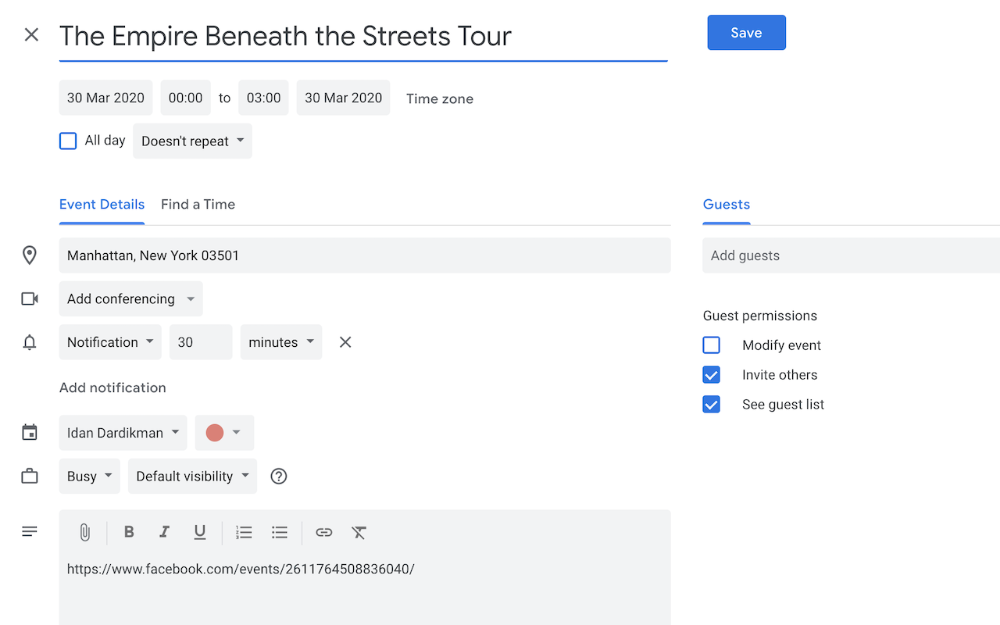

# 🗓 facebook2calendar
**A chrome extension to add facebook events to google calendar**

After installing the extension it will add a "+Calendar" to all your facebook events, like so:

Clicking the button will open a new calendar tab with the event's details loaded, like this:

That's it! simple right? let me know if you have any issues